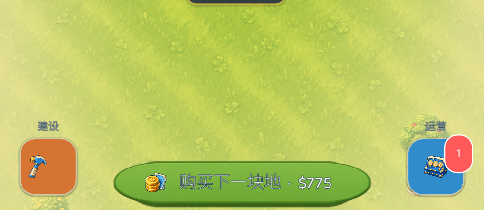
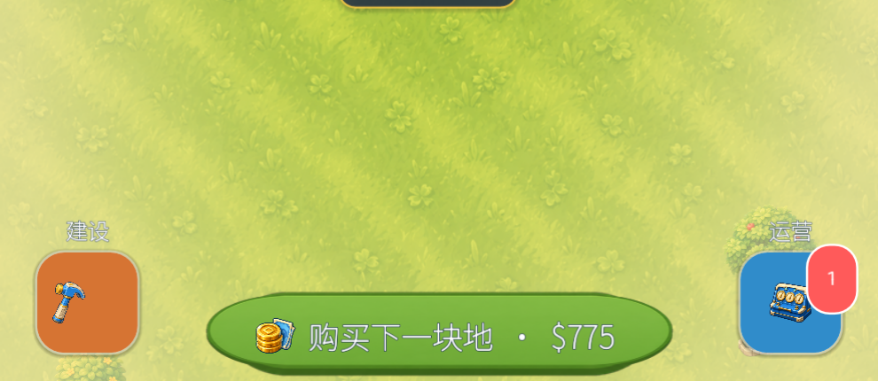

# 11 · 世界空间系统重构与终检清单

> 生成于 2026-08-03，基于 10 号计划全批次执行后的 30 态截图逐屏复查 + 关键区域放大取证。
> **总判断（直说）**：单体资产这轮基本到位了——建筑组、图标（ic_cash 级别的质量）、棋盘、系统页、面板都已达标或接近达标。整体仍然「不像一线」的原因不再是资产质量，而是三件事：
> ① **世界主屏没有空间系统**——路、地块、装饰互相不对齐，建筑是「摆上去的」不是「种在园区里的」；世界主屏是玩家 80% 时间看的屏幕，它拉低了一切；
> ② **三处标记为完成但实测未修的项**（假完成）；
> ③ 若干素材细节（草地色带、图标在小尺寸下不可读、影子方向不一）。
> 本轮聚焦收敛这三件事，不铺新面。

---

## 1. 实测不达标清单（F 系列，全部有截图证据）

| # | 级别 | 问题 | 证据 | 修法摘要 |
|---|---|---|---|---|
| F1 | **P0·假完成** | 主 CTA「购买下一块地·$775」文字是**灰蓝色填充**，不是纯白（10 号文档 §9 记录 R2 已完成，实测未修） | z_cta3 放大图：文字填充 ≈ #aab6c4 | 排查 `primary_action_button` 专属路径：`_refresh_primary_action` 里的 `apply_button_color` 之后是否有 `font_color` 覆盖；用视觉门禁的对比断言真正覆盖这颗按钮（当前断言疑似漏掉了它） |
| F2 | **P0** | 路网是一条垂直灰胶带：正交俯视贴图 vs 3/4 等距建筑视角打架；路不连接任何建筑入口、不对齐地块 | campus_dense | 见 §2 世界重构 |
| F3 | **P0** | 无统一地块系统：dense 视图里建筑各坐各的白色异形底座，地块边界不可见，「买地」的空间逻辑无法被看见 | campus_dense vs map_built（后者 T0 有独立水泥垫，前者全无） | 见 §2 |
| F4 | P1 | 草地 tile 有明显对角色带（平铺后成规律条纹）；边缘雾/暗角覆盖过强，整屏像隔了脏玻璃 | campus_dense / map_built 全图 | tile 重生成（prompt 明确 no directional stripes / no vignette）；`world_edge_fog` alpha 降至 0.25 且只贴四角，去掉全屏暗角 |
| F5 | P1 | 待售地块是农场木栅栏风，与科技园区违和 | map_built | 素材重做 `plot_pad_sale`：混凝土空地 + 蓝白围挡 + 出售立牌（见 §2 清单） |
| F6 | P1 | 建筑烘焙影子方向不一致（T0 影子偏左下、T1 偏右下） | campus_dense 左上两座对比 | 重生成时统一附加 "light from upper-left, shadow falls to lower-right"；只需重生成方向错误的档（核对后列清单） |
| F7 | P1 | 棋盘安装中机柜的倒计时黑胶囊被格子裁掉一半（1m39s 只露一半） | dc_board 中上格 | 倒计时移到格子下缘外 8u 或缩为格内顶部细条+右上角时间文字；`clip_contents` 保持 |
| F8 | P1 | 计算机柜贴图深色，在格子深底上依旧看不清（09-A7 未执行或不足） | dc_board 左上格 | 重生成 `rack_compute_*`：navy 换为亮银白机身 + 蓝色 LED 面板 |
| F9 | P1 | 图标小尺寸可读性：`ic_power` 徽章上是「闪电插在篮子里」，44u 下读不出；HUD 时代图标（蓝盒）语义弱 | z_badge 放大图 / HUD 左上 | `ic_power` 重生成为纯粗闪电（gold bolt, no container）；`ic_era1-3` 重生成为「奖章框内数字 I/II/III + 时代元素」 |
| F10 | P1 | 底部圆钮标签是彩色小字（建设=橙、运营=蓝）压在世界上 | campus_dense 底部 | 标签统一白字 + ink 描边 3 + 20u |
| F11 | P0·流程 | 本轮英文 30 态未复跑 | — | 全部修复后 zh/en 双跑，恢复双语门禁纪律 |

---

## 2. 世界空间系统重构（本轮核心工程）

**原则：世界上所有东西都锚定在同一个等距地块网格上。** 不是加更多装饰，而是给已有元素立规矩。

### 2.1 网格与地垫

1. `park_map` 定义显式网格：地块槽位按固定间距排布（列距 = pad 宽 + 40u 车道，行距同理），每个槽位一块**统一地垫**；
2. 地垫素材（新，等距 3/4 与建筑同视角）：
   - `plot_pad_std`（768²）：浅灰混凝土方形地垫，圆角，四角矮桩，与建筑基座同色系——所有 T0/T1 坐它；
   - `plot_pad_large`（1024²）：同款放大——T2/T3 坐它；
   - `plot_pad_sale`（768²）：同款地垫 + 蓝白条纹围挡两段 + 立式「出售」牌（替换农场木牌，修 F5）；
   - Prompt 模板：Isometric 3/4 top-down concrete plot pad for a cartoon tech-campus game, light warm gray with subtle expansion joints, rounded corners, four short corner posts, same 30° camera as the building set, light from upper-left, soft shadow lower-right, transparent background.
3. 建筑贴图居中坐在地垫上（建筑自带的小基座与地垫叠加是可接受的，验证不穿帮即可）。

### 2.2 路网

1. 重做路素材为**等距角度**（与建筑同 30°）：`road_iso_a`（↗ 走向）、`road_iso_b`（↘ 走向）、`road_iso_cross`；浅暖灰、圆角边、两侧草色过渡；
2. 路只铺在**网格车道**（相邻地垫之间的 40u 间隔带），跟随地垫网格自动连接；扔掉现在的垂直贯穿条（修 F2）；
3. 车道尽头自然淡出（路段素材两端自带草色渐变）。

### 2.3 装饰锚点

1. 每块地垫四角外侧定义 4 个 deco 锚位；按地块 index 种子放 0–2 个（旗杆/路灯/灌木排）；
2. `deco_pylon`（变电站组，质量很好）改为**锚定**在已装供电的机房地垫右后锚位——它是供电的世界表达，不再悬浮在地块之间；
3. 树/灌木只出现在网格外围的「园区绿化带」，不进车道。

**验收**：campus_dense 重拍——所有建筑坐在统一地垫上、路沿车道连接、无悬浮装饰；把截图旋转 45° 看，网格秩序一眼可辨。存 `docs/ui_review/` 前后对比。

---

## 3. 修复细则（F1/F7–F10）

- **F1**：先写断言再修——视觉门禁把 `PrimaryWorldAction` 单独点名断言（font_color 必须纯白）；然后顺着 `_refresh_primary_action` 找覆盖源（怀疑 `_set_button_asset` 或早期遗留的 `add_theme_color_override`）。修完后 z_cta3 同位置重拍确认。
- **F7**：`datacenter_board._add_slots` 安装中分支：timer 改为格内顶部 6u 进度细条 + 右上 18u 时间文字（白+描边），不再用黑胶囊。
- **F8/F9**：素材重生成三件（rack_compute 亮化、ic_power 纯闪电、ic_era1-3 奖章化），走管线接入；F9 完成前 HUD 时代 chip 可临时用「时代 N」纯文字。
- **F10**：`round_entry` 标签样式统一 `world_text`（白+ink 描边 3）。

---

## 4. 色调微调（配合 F4）

1. `world_edge_fog`：alpha 0.5–0.65 → **0.25**，只保留四角 1/4 圆区域，中央完全无覆盖；
2. 若仍有「脏」感，去掉 fog 层改为仅在夜晚档启用；
3. 草地 v2 tile prompt：Seamless tileable cartoon lawn texture, uniform yellow-green, fine hand-painted grass strokes in random directions (NO directional stripes, NO vignette, NO large patterns), tiny clover accents at 3% density, flat even lighting, reads calm at 25% zoom.

---

## 5. 执行顺序

| 批次 | 内容 | 预估 |
|---|---|---:|
| ① | F1 断言+修复、F7、F10（纯代码，半天见效） | 0.5d |
| ② | §2 世界重构代码侧（网格/车道/锚点，先用现有素材占位跑通） | 1.5d |
| ③ | §2 素材六件 + F4 草地 v2 + F5 sale pad + F6 影子统一重生成 → 接入 | 1d 接入（生成并行） |
| ④ | F8/F9 三件小素材接入 + §4 fog 调整 | 0.5d |
| ⑤ | zh/en 双 30 态回归（F11）+ campus_dense/map_built 前后对比图 + 真机过一遍 | 0.5d |

**验收纪律升级（针对本轮出现的假完成）**：每个 F 编号关闭时必须附「同位置放大截图」贴在本文档 §6 验收记录里，文字性的「已完成」不再作数。

## 6. 验收记录（执行方填写，逐项附图）

### 批次① · 代码重灾项

- [x] **F1 · 主 CTA 中文填充恢复纯白。** 新增 `PrimaryWorldAction` 专属断言：按钮五种交互态必须为纯白，外层必须使用 4u ink 描边；同时点名检查 `PrimaryWorldActionText` 的描边层与 `PrimaryWorldActionTextFill` 的纯白填充层。断言先在旧实现上按预期失败（`campus_dense`），修复后简中 30 态通过。以下两图均取 `campus_dense` 的 `(x=155, y=1815, w=680, h=220)`：

  | 修复前 | 修复后 |
  |---|---|
  |  |  |

- [x] **F7 · 棋盘安装倒计时不再裁剪。** 底部黑胶囊改为格内顶部 12u 进度细条 + 右上 18u 白字时间；新增结构断言，要求计时容器完全落在 `RackSlot` 内、进度条高度不超过 14u、时间右对齐且至少 3u ink 描边。以下两图均取 `dc_board` 的 `(x=125, y=790, w=740, h=650)`：

  | 修复前 | 修复后 |
  |---|---|
  |  |  |

- [x] **F10 · 世界底部入口标签统一。** 建设/运营标签统一为 20u、900 字重、纯白填充、3u ink 外描边；新增双标签点名断言，禁止再次回到小号彩色字。以下两图均取 `campus_dense` 的 `(x=0, y=1620, w=990, h=430)`：

  | 修复前 | 修复后 |
  |---|---|
  |  |  |
