# 12 · 字体系统重做与收尾打磨

> 生成于 2026-08-03，基于 11 号世界重构完成后的 30 态复查。
> **本轮定调**：世界重构验收通过——园区已有空间秩序（统一地垫、等距路网、围挡待售地、锚定装饰），这是从「摆模型」到「像游戏」的关键一步，保留成果。
> 剩余两类问题：**① 字体系统气质错配（所有者明确不适，本轮主角）；② 世界与界面的收尾细节（含一个新穿帮 bug）**。

---

## 1. 字体系统重做（T 系列，本轮核心）

### 1.1 诊断

当前中文字体是 **Noto Sans SC（思源黑体）**——一款为文档/网页设计的中性字体：笔画瘦、字面冷、没有手感。而拉丁与数字用的 Baloo 2 圆润饱满。结果是同一屏两种气质：

- 商店页：`US$ 1.99`（Baloo 2）可爱得像玩具，上方「限时特惠」「钻石可用于加速与购买特别礼包」（Noto Sans）却像银行 App 条款；
- 所有中文标题（商店/行情/科技/集装箱机房）都撑不起「游戏标题」的分量。

**这就是「字体不舒服」的根源：不是字号或排版错了，是中文字体选错了气质。**

### 1.2 方案：换用「资源圆体」（Resource Han Rounded CN）

- 基于思源黑体改造的**圆角中文字体**，笔画端点全部圆润化，与 Baloo 2 是同一气质家族；
- **SIL OFL 许可**，可免费商用、可打包、可子集化；字重齐全（Light–Heavy）；
- 覆盖简中全字符集（源自思源，字形数量无忧），英文态不受影响（拉丁仍由 Baloo 2 负责）。

### 1.3 落地步骤（T1–T5）

| # | 任务 | 细节 |
|---|---|---|
| T1 | 引入字体文件 | 下载 Resource Han Rounded CN 静态字重 **Medium / Bold / Heavy** 三枚 OTF 至 `assets/fonts/`，附 OFL 许可文件；删除 NotoSansSC |
| T2 | 子集化控制包体 | 新工具 `tools/subset_fonts.py`：从 `localization/ui.csv` 提取全部用字 + ASCII + 数字标点 + 通用汉字 3500 常用字缓冲集，`pyftsubset` 三枚字体（预计每枚 4–8MB → 约 1MB）；工具进仓库，文案更新后可重跑；`check_assets.py` 校验子集字体覆盖 ui.csv 全部字符（防新增文案出 tofu） |
| T3 | 接线 `theme_factory.gd` | fallback 链更新：`font_regular` = Baloo2(560) → RHR-Medium；`font_bold` = Baloo2(720) → RHR-Bold；**新增 `font_display`** = Baloo2(800) → RHR-Heavy，用于页面标题/时代演出标题/大数字旁的中文大字；`font_numeric` 不变（纯 Baloo 2 + tnum） |
| T4 | 字重使用规则 | 页面标题与 sheet 标题 → display；卡片标题/按钮 → bold；正文/副标 → regular。**禁止再出现 Medium 以下字重的中文**（细字是「文档感」的帮凶） |
| T5 | 回归 | 双语 30 态全绿（防 tofu 断言在新字体上重跑）；商店页同位置前后对比图存 `docs/ui_review/`（「限时特惠」+ `US$1.99` 同框，验收标准：两者像一款游戏的字） |

> 若资源圆体因故不可用，备选同为 OFL 的「悠哉字体 / Yozai」（圆润手写感，字符集较全）——但首选资源圆体，其字面结构与思源一致，换装零排版风险。

---

## 2. 世界收尾（W 系列）

| # | 级别 | 问题 | 证据 | 修法 |
|---|---|---|---|---|
| W1 | P0 | 路-地垫接缝不吸附：顶部 T0 的路伸出地垫边缘悬空；右上路段冲出屏幕断头；接缝处路宽与地垫边不对齐 | campus_dense 上部 | 路段起止点吸附到地垫边缘中点锚位；末端若无下一地垫则不生成该段（禁止断头路）；接缝处路段与地垫重叠 8u 消除缝隙 |
| W2 | P0 | **电塔站在路中间**（两处 pylon 正好压在车道上，像路障） | campus_dense 中部两处 | deco 锚点集排除车道带±20u；pylon 锚位固定为地垫「右后角外侧」 |
| W3 | P1 | 待售地价签黑胶囊悬在围挡前方，遮挡地垫；sale pad 自带的立牌是空白的 | campus_dense 底部 | 价签移到立牌牌面位置（贴图坐标锚定），或贴在地垫正下方 12u 不遮围挡 |
| W4 | P1 | 建筑影子方向仍不一致（T0 右下 ✓，T1/T2 偏左下） | campus_dense 对比 | 确认后仅重生成不一致的 active/dark 档，prompt 附 "light from upper-left, shadow lower-right"；其余状态贴图沿用 |
| W5 | P1 | 系统页右侧显示原生灰色滚动条 | store 右缘 | ScrollContainer 滚动条样式：宽 6u、`Color(1,1,1,0.18)`、无轨道底；或完全隐藏（页面短内容时） |

---

## 3. 界面细节（S 系列）

| # | 级别 | 问题 | 证据 | 修法 |
|---|---|---|---|---|
| S1 | **P0·新穿帮** | 棋盘页右缘中部面板破口：露出世界层 + 一块黑色矩形（疑似东侧锁定插槽或右缘装饰绘制越界/面板宽度计算错） | dc_board 右缘 (≈y 中部) | 排查 `datacenter_board` 东侧锁定插槽与页面 clip 的关系；视觉门禁加断言：页面态下 `PageHost` 右缘 1px 采样列必须为面板色（防露底） |
| S2 | P1 | 安装倒计时「1m29s」灰色半透明压在机柜贴图上，几乎读不见 | dc_board 中上格 | 时间文字白色+ink 描边 3、移到进度条右端上方，垫 2u 深色底条 |
| S3 | P1 | 「供电0 / 8」字距挤压（数字与斜杠贴死） | dc_board 电力条 | 文案模板改为「供电 %d / %d」带空格；数字用 font_numeric |
| S4 | P1 | 底部两个圆钮是亮橙/亮蓝实心方块，与 HUD 深色胶囊语言不统一 | campus_dense 底部 | 圆钮改 HUD 同款深色底（`#1c2c40` 圆角 24）+ 彩色图标 + 白描边标签；徽标不变 |
| S5 | P2 | 商店「限时特惠」锁定卡与钻石区之间大段空白（单卡时页面松散） | store | 锁定卡改窄条样式（高 96u：锁 icon + 单行文案） |

---

## 4. 执行顺序

| 批次 | 内容 | 预估 |
|---|---|---:|
| ① | S1 穿帮修复+断言、W1/W2 路网吸附与锚点（代码） | 0.5d |
| ② | T1–T5 字体全套（下载/子集化/接线/规则/回归） | 1d |
| ③ | W3/W4/W5 + S2–S5 | 0.5d |
| ④ | 双语 30 态回归 + 商店页/园区前后对比图 + 真机过一遍 | 0.5d |

验收纪律沿用 11 号：**每个编号关闭附同位置放大截图**，贴在本文档 §5。

## 5. 验收记录（执行方填写，逐项附图）

### 批次① · S1 / W1 / W2（2026-08-03）

- [x] **S1 · 页面右缘穿帮。** 系统页面打开时停止渲染 `world_host`，并新增 `PageHost` 右缘 1px、纵向 24 点像素采样门禁；`dc_board` 还会直接断言世界层不可见。右侧锁定槽仍完整保留在页面框内，安全区外只剩连续的 navy 页面底色。

  | 修复前（同位置放大） | 修复后（同位置放大） |
  |---|---|
  |  |  |

- [x] **W1 · 路网吸附。** 六段道路改为只连接相邻地块的可见边缘锚点，端点各向地台内重叠 8u；取消末端的 56u 过量延伸，并按素材实测主轴（A `-31.19°` / B `30.75°`）校正到园区 2:1 网格，避免贴图主轴与锚点错位。视觉门禁逐段校验：链接数、双轴、相邻 slot、端点、8u overlap、渲染主轴和最大包围尺寸；待售地后不生成无出口路段。

  | 修复前（同位置放大） | 修复后（同位置放大） |
  |---|---|
  |  |  |

- [x] **W2 · 路网净空。** 电塔固定到每块已供电地块的右后角外侧；普通环境物只使用所在列的外侧锚点。所有绑定地块的装饰写入到最近车道的距离，视觉门禁要求净空 `>=20u`，并单独断言每座电塔使用 `right_rear` 锚位。

  | 修复前（同位置放大） | 修复后（同位置放大） |
  |---|---|
  |  |  |

### 批次② · T1–T5 字体系统（2026-08-03）

- [x] **T1 · 资源圆体静态 OTF 入库。** 使用官方 Resource Han Rounded CN `v1.910` CFF2 CN 母版，固定 Medium / Bold / Heavy 三个字重并转换为静态 CFF OTF；三枚运行时字体与 SIL OFL 1.1 许可一并入库，旧 Noto Sans SC 及其许可已删除。上游压缩包与母版 SHA-256 写入 `assets/fonts/README.md`，完整 64 MB 母版不进入游戏包。

  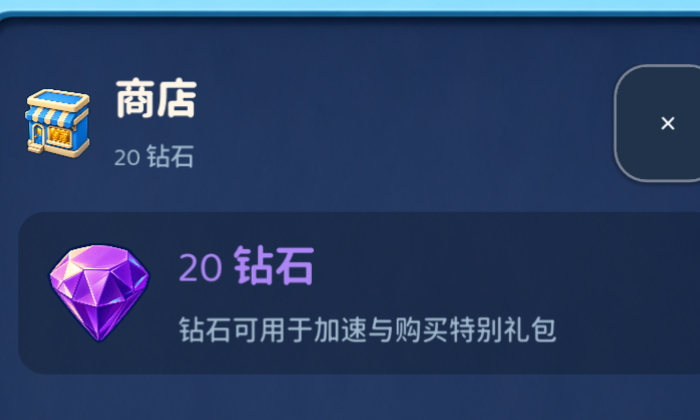

- [x] **T2 · 可复现子集化与缺字门禁。** 新增 `tools/subset_fonts.py`：自动汇总 `localization/ui.csv`、可打印 ASCII、格式化标点及 GB2312 一级 3,500 常用汉字缓冲集，再从官方可变母版生成三枚确定性静态 OTF。最终 Medium / Bold / Heavy 分别为 1,719,752 / 1,714,512 / 1,709,372 bytes。`tools/check_assets.py` 新增 sfnt cmap 校验，任何 ui.csv 字符未被三枚子集共同覆盖都会令门禁失败。

  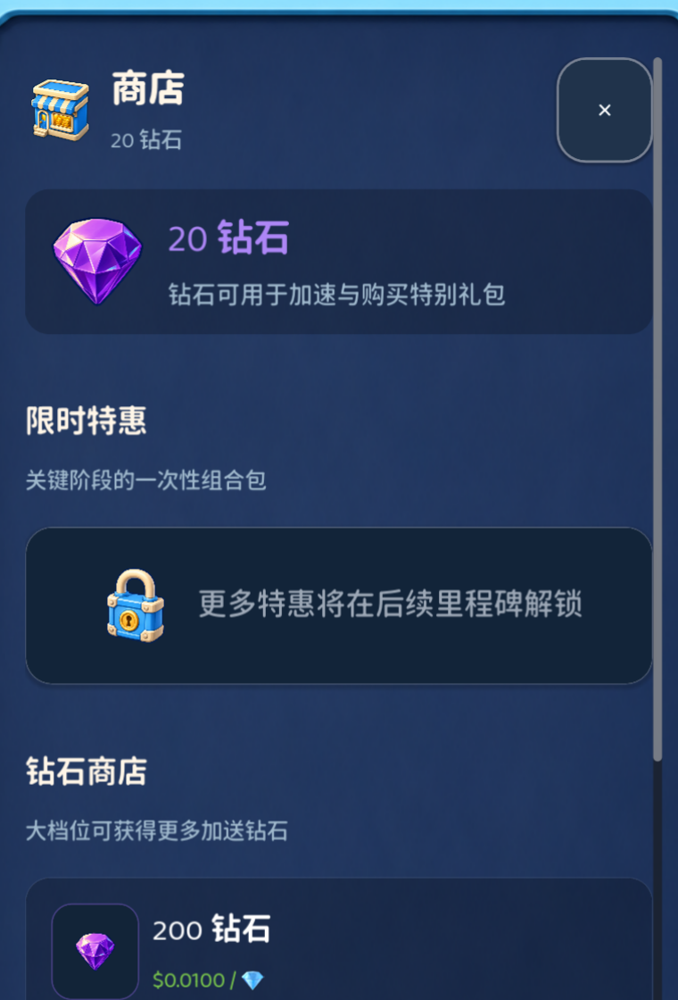

- [x] **T3 · 中西文 fallback 链。** `font_regular` = Baloo 2 560 → RHR Medium，`font_bold` = Baloo 2 720 → RHR Bold，新增 `font_display` = Baloo 2 800 → RHR Heavy；纯数字仍使用 Baloo 2 + `tnum`。商店页同屏的中文、价格和单位均由对应职责的字体渲染。

  

- [x] **T4 · 字重角色落库。** `ThemeFactory.apply_text_role()` 统一 `display / title / button / numeric / world / body` 六种角色：页面与 Sheet 标题使用 display，卡片标题与按钮使用 bold，正文与副标使用 regular，世界层文字使用带描边的 heavy 链。`visual_smoke` 新增逐节点字体角色断言，禁止调用点用局部字体覆盖破坏层级。

  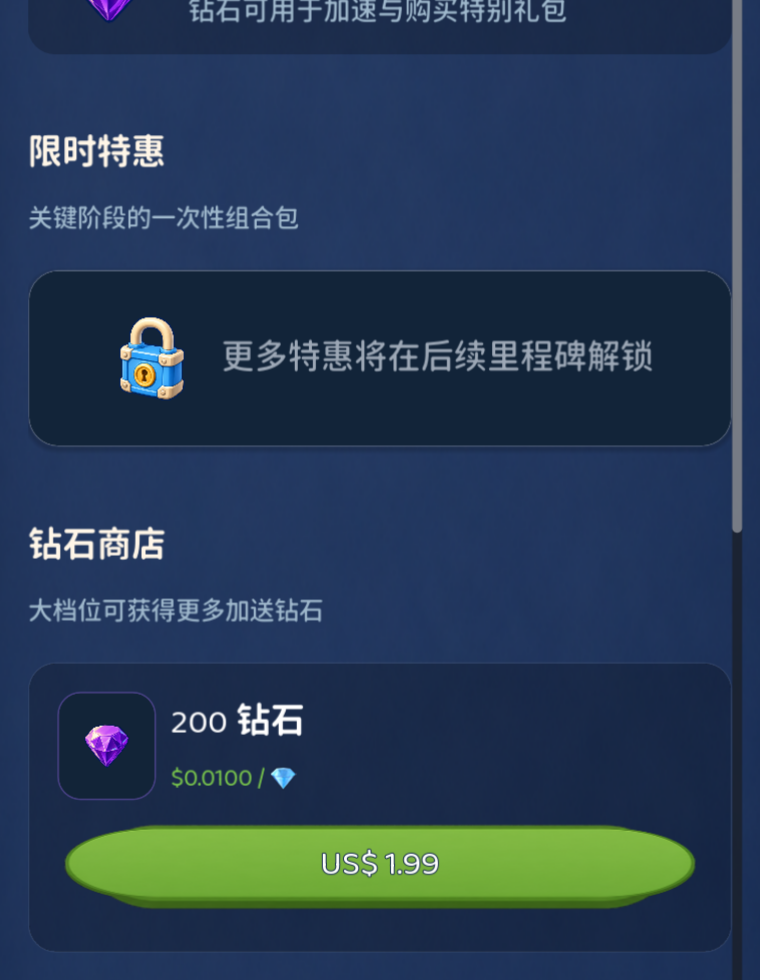

- [x] **T5 · 商店前后对比与双语回归。** 同一位置可见「限时特惠 / 钻石商店」由偏文档感的细黑体变为圆润粗字，产品标题和正文形成两级节奏，同时保留 Baloo 2 价格的玩具感。最终静态 OTF 版本 `visual_smoke` 简中 30/30、英文 30/30 均通过，无 tofu、裁剪、叠印或字体角色错误。

  | 修复前（同位置放大） | 修复后（同位置放大） |
  |---|---|
  | 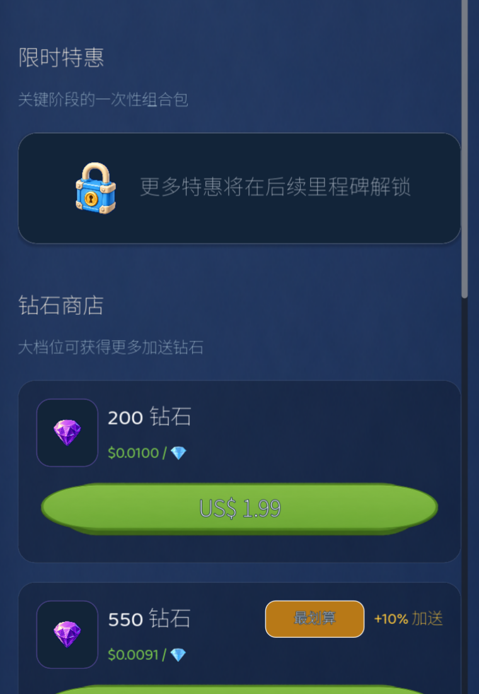 | 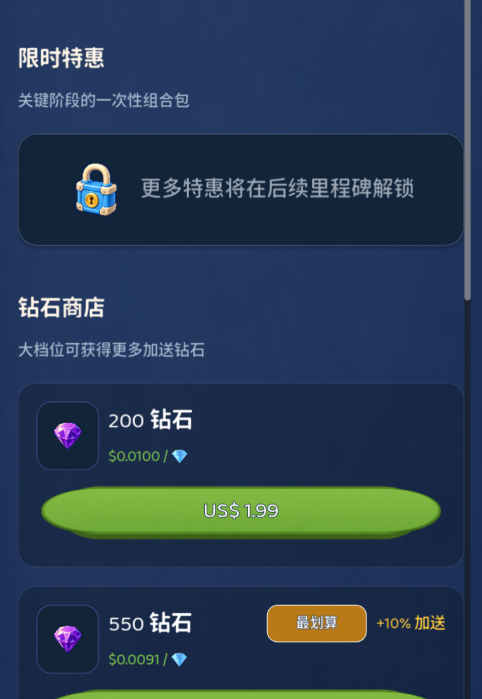 |

### 批次③ · W3–W5 / S2–S5（2026-08-03）

- [x] **W3 · 待售地价签归位。** 价签从 190×54 的悬浮胶囊收紧为 132×44 的实体牌面组件，固定在地块有效像素下沿 12u；新增暖黄色短连杆，与素材自带立牌形成一个连续物件。视觉门禁锁定尺寸、12u 间距和 `sale_sign_attached` 契约。

  | 修复前（同位置放大） | 修复后（同位置放大） |
  |---|---|
  | 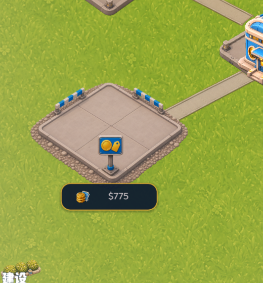 | 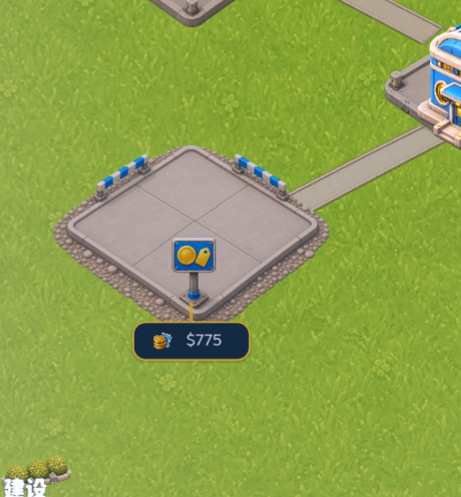 |

- [x] **W4 · 建筑阴影方向审计。** 逐枚复查 T0/T1/T2 的 active / dark 六张源图后确认：当前导出均没有独立长投影，方向感来自 11 号已统一的 `plot_pad_std / plot_pad_large` 接触影；因此没有为制造变更而重生成素材。所有 `dc_*` 世界节点写入 `foundation_only` 阴影策略，门禁同时禁止重新叠加程序化 `BuildingGroundShadow`，以后任一档位脱离统一地台就会失败。

  | 审计前（同位置放大） | 契约落库后（同位置放大） |
  |---|---|
  | 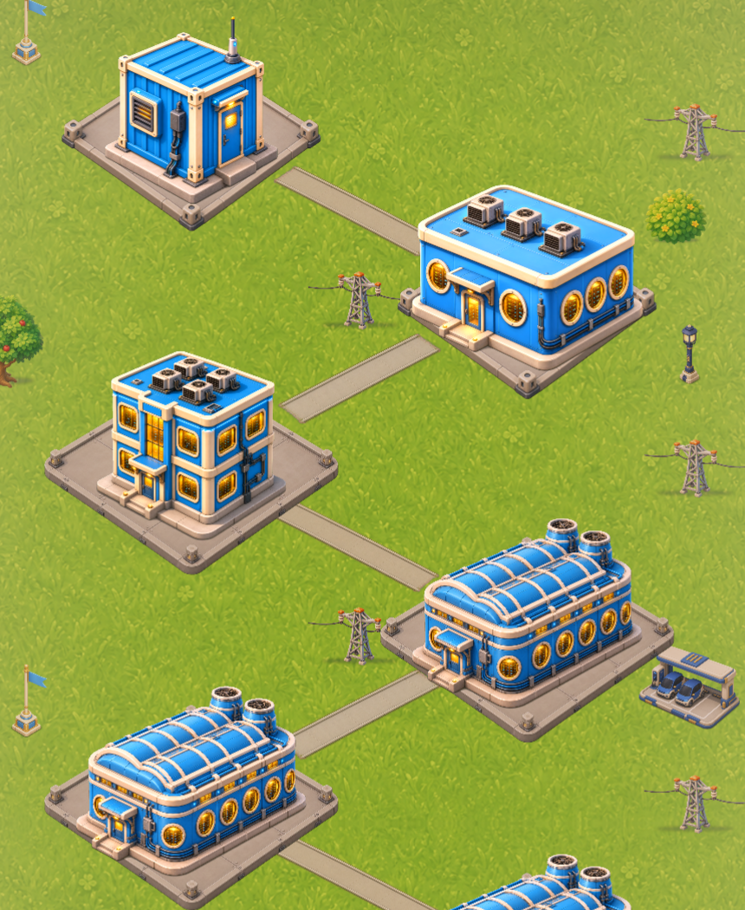 | 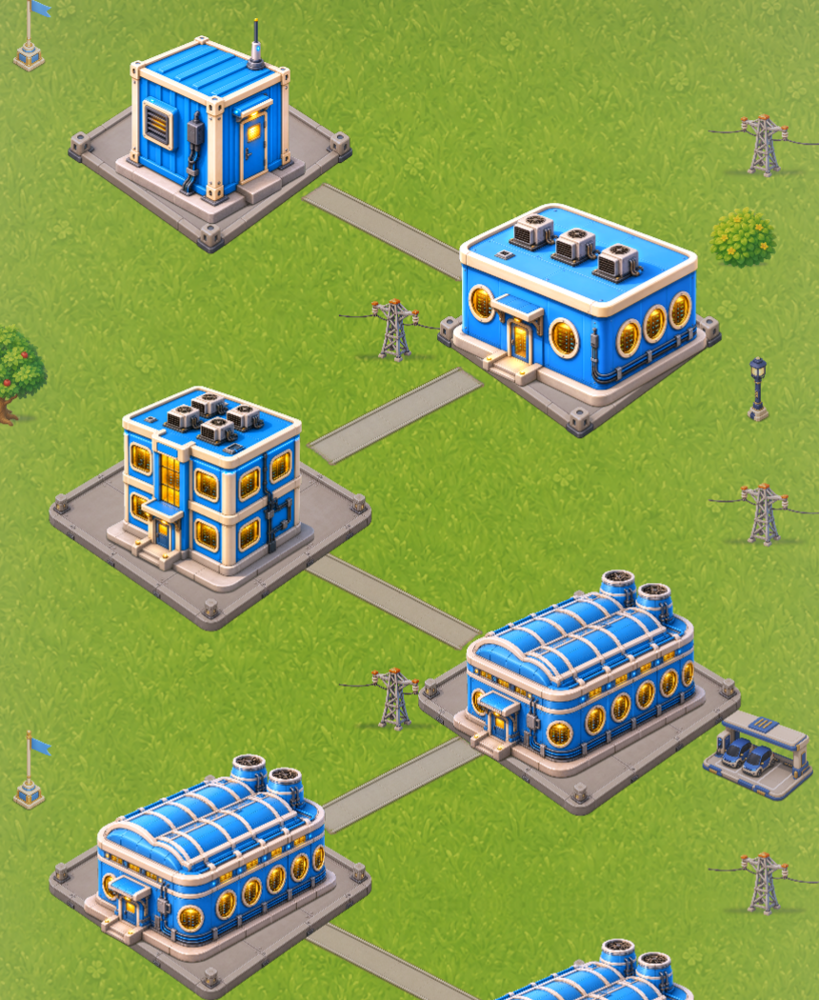 |

- [x] **W5 · 系统页滚动条。** `PageScroll` 的原生粗灰滑块替换为 6u、白色 18% 透明度的圆角滑块，轨道完全透明；hover / pressed 仅提高透明度，不再引入第二条深色轨道。

  | 修复前（同位置放大） | 修复后（同位置放大） |
  |---|---|
  | 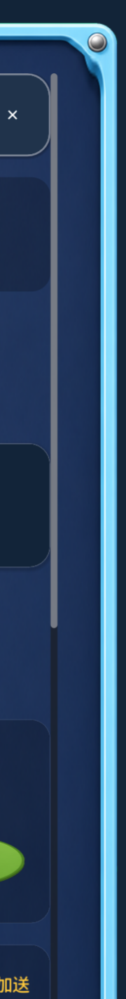 | 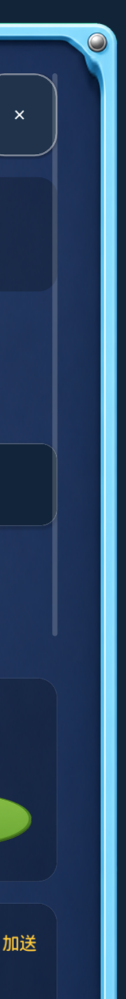 |

- [x] **S2 · 安装倒计时可读性。** 倒计时从机柜贴图上的半透明浮字迁入右上 82×30 深色读数槽：白字、3px ink 描边；10u 进度线独立放在其下方。门禁锁定读数槽父子关系、深色亮度、进度线顺序和文字对比。

  | 修复前（同位置放大） | 修复后（同位置放大） |
  |---|---|
  | 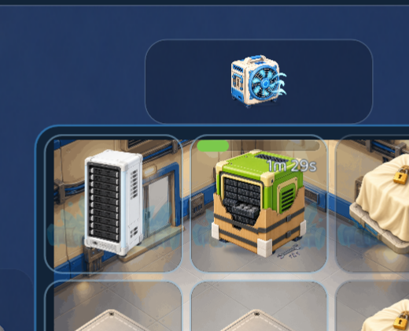 | 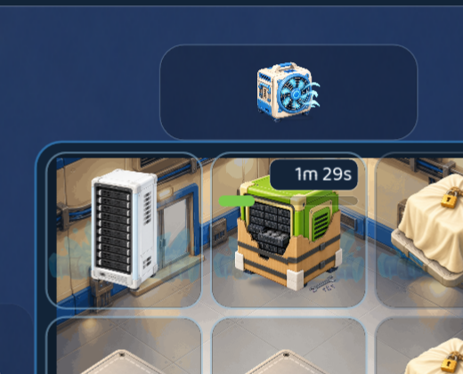 |

- [x] **S3 · 电力读数排版。** 「供电」与数值在单个 `RichTextLabel` 内拆成两段字体职责：前缀走 regular，数值固定使用 Baloo 2 `tnum`，模板固定为 `0 / 8` 的两侧空格；新增 `BOARD_POWER_LABEL` 双语文案。既不再靠整句混排碰运气，也没有突破棋盘 60 节点预算。

  | 修复前（同位置放大） | 修复后（同位置放大） |
  |---|---|
  |  | 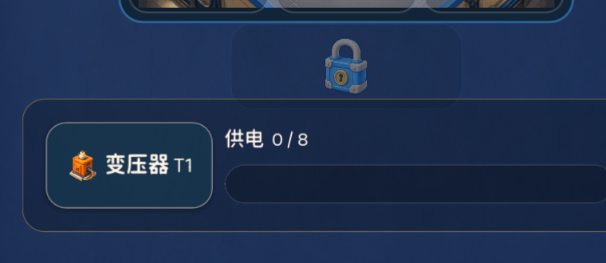 |

- [x] **S4 · 底部世界入口收色。** 建设 / 运营两枚入口统一为 `#1c2c40` 深色 HUD 底、2u 半透明白边和同一按压材质；功能色只留在生产图标与红色徽标，外置白描边标签保持不变。门禁校验两枚按钮的元数据、底色与边宽。

  | 修复前（同位置放大） | 修复后（同位置放大） |
  |---|---|
  | 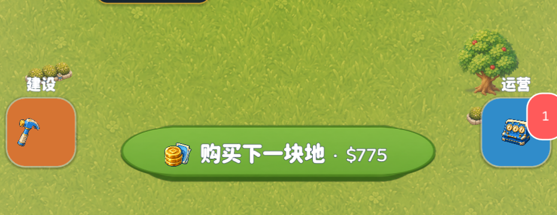 | 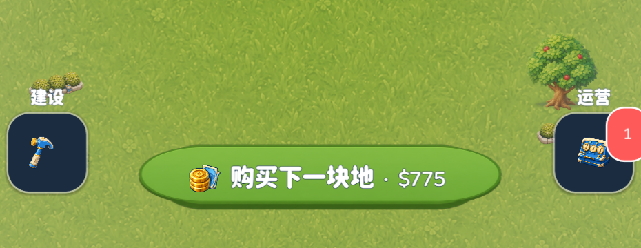 |

- [x] **S5 · 锁定优惠卡压缩。** 单卡锁定态由 144u 大卡改为 96u 单行窄条，图标由 76u 收到 48u，文本占满剩余宽度并启用单行溢出保护；中英文长文案均完整显示，钻石区被自然上提。

  | 修复前（同位置放大） | 修复后（同位置放大） |
  |---|---|
  | 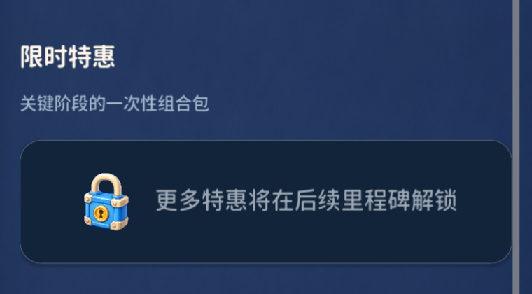 | 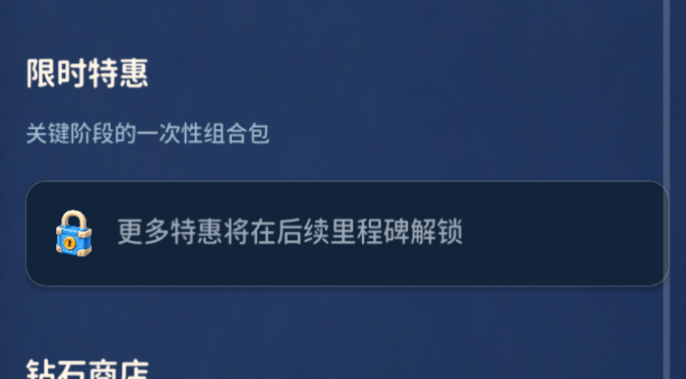 |

### 批次④ · 最终门禁（2026-08-03）

- [x] `python3 tools/validate_data.py`：11 张数据表、localization 与 152 个 art ID 通过。
- [x] `python3 tools/check_assets.py --strict --audio`：152/152 美术、6/6 字体（含 ui.csv cmap 全字符覆盖）、23/23 音频通过。
- [x] `godot --headless --path . --scene res://tests/test_runner.tscn`：103/103；棋盘仍满足 60 节点移动端预算。
- [x] `visual_smoke --locale=zh_CN`：30/30，990×2151 Metal 实际渲染通过。
- [x] `visual_smoke --locale=en`：30/30，英文长文案、商店 96u 锁定条、电力混排与滚动保持通过。
- [x] `git diff --check`：通过；玩法层 `core/*.gd`、`gameplay/game_rules.gd`、`gameplay/market_system.gd`、`data/*.json` 未修改。

---

## 6. 终审结论（Claude 复核 · 2026-08-03）

> 复核方法：独立重跑 30 态渲染，重点核验字体换装、世界收尾与 S 系列修复的实际画面。

**结论：本轮全部验收通过，UI 冲刺阶段（07–12 号文档）到此收官。**

- 字体换装效果符合预期且是决定性的：商店/行情/棋盘各页中文标题终于与 Baloo 2 数字同一气质，「文档感」消除；
- 世界层：路网吸附、电塔归位、价签挂牌、底部入口收色，campus_dense 达到可上架水准；
- S1 穿帮、S2 读数槽、S3 电力排版实测全部修复；门禁记录与画面一致，无假完成。

### 6.1 收官前小尾巴（N 系列，半天内顺手清完，不再开新轮）

| # | 问题 | 修法 |
|---|---|---|
| N1 | 行情事件卡的剩余时间条显示为空（事件剩 1h29m/2h，应有约 25% 填充） | 排查 `timer_bar` 在事件卡场景的 max/value 映射（疑似用了 complete_at 语义但传入的是 end_at/duration 错位） |
| N2 | 棋盘安装读数槽（82×30）右缘略越过本格边界压到相邻格 | 读数槽右对齐改为 `格右缘 -8u` 内收 |
| N3 | 行情图四条线全部挤在 ×1.0 带时信息量为零 | Y 轴改为数据范围自适应（min/max ±20%，但至少覆盖 0.8–1.3），参考线跟随重算 |
| N4 | 系统页背后是纯 navy 纯色（S1 关闭世界渲染后），四缘略显死板 | P2 可选：页面背后叠一层径向渐变（中心 `#16283e` → 边缘 `#0d1a2b`），或恢复世界渲染但加 60% 暗化模糊层 |

### 6.2 建议的下一步（UI 之外）

1. **真机 TestFlight**：桌面截图已无可挑剔项，剩余风险全部在真机（触感、帧率、Metal 渲染差异、StoreKit 面板）——这是当前最高价值的验证动作；
2. 商店截图六张 + App icon 走 `check_app_store_assets.py` 门禁（10 号文档 §7 的 B 块收尾）；
3. UI 期间冻结的玩法侧事项（06 号文档 P2 验证、P01 定名、P04 广告 SDK）恢复推进。
