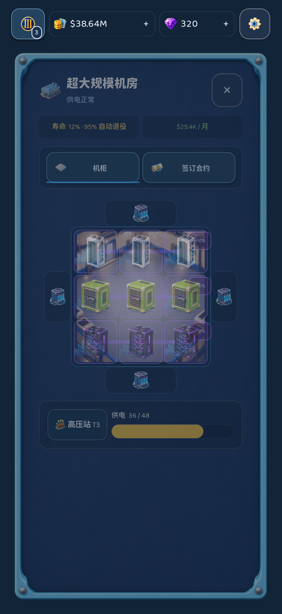
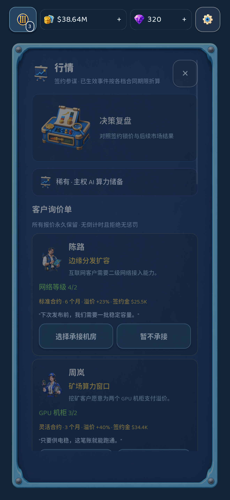
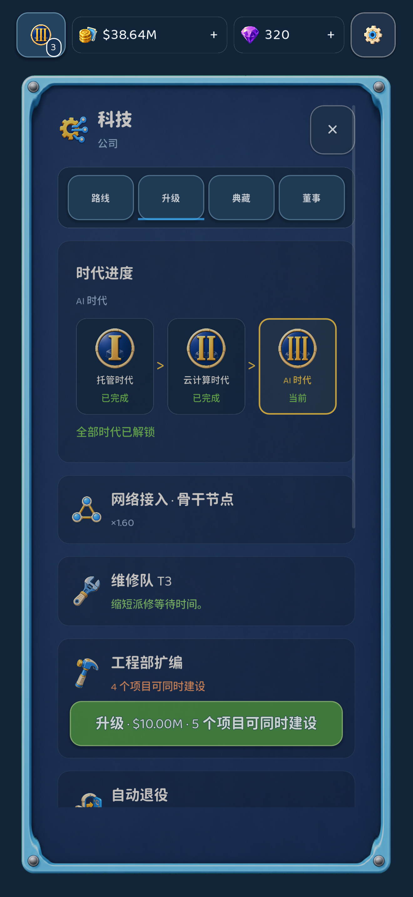
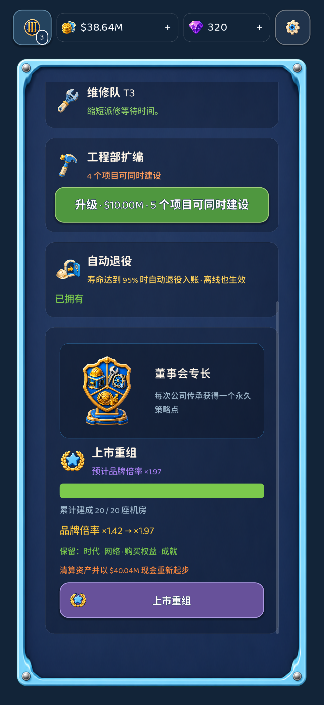
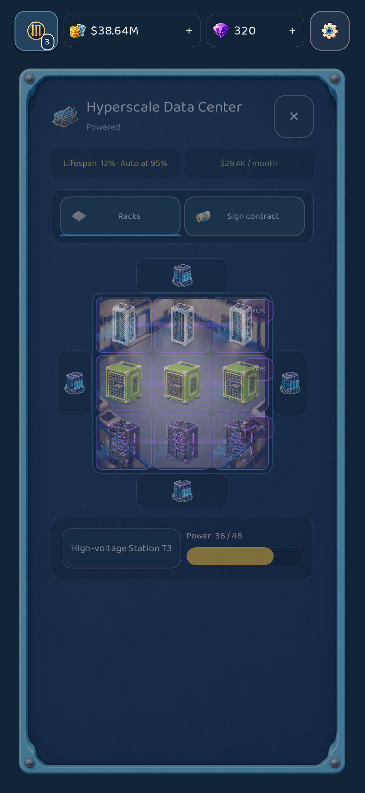
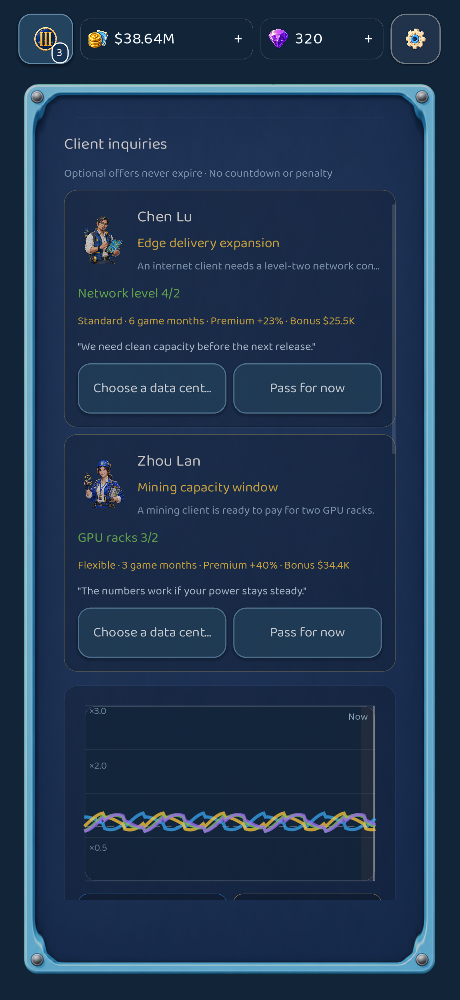
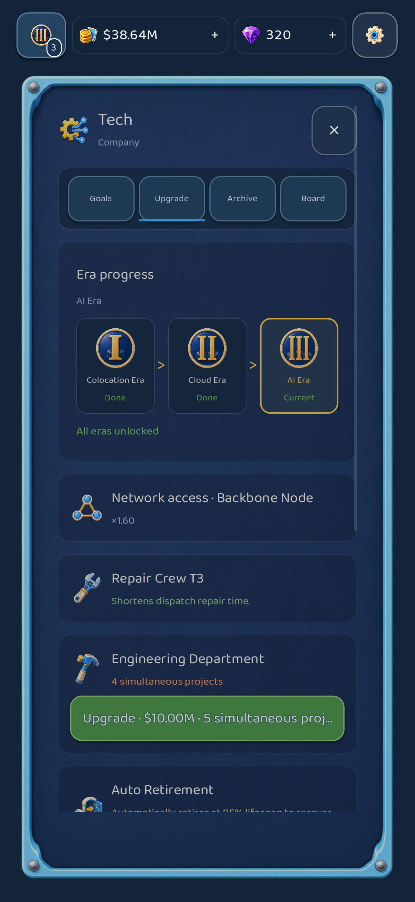
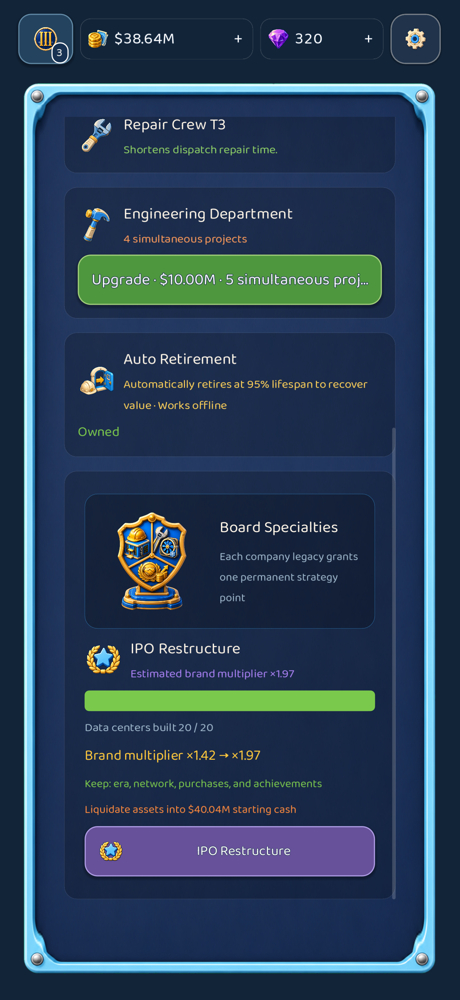

# App Store 截图审片索引

以下 10 张图片由 `tests/store_shots.tscn` 从同一份真实存档夹具原生渲染。中英版本只切换语言；画面状态、相机和页面位置保持一致。

行情屏定位在两张询价人设卡与历史曲线的交界，以同屏展示永不过期的主动报价和真实行情轨迹。

## 简体中文 · iPhone 6.9 英寸

| 园区 | 机房 | 行情 | 科技 | 上市重组 |
|---|---|---|---|---|
|  |  |  |  |  |

## English · iPhone 6.9-inch

| Park | Data center | Market | Technology | Public listing |
|---|---|---|---|---|
|  |  |  |  |  |
